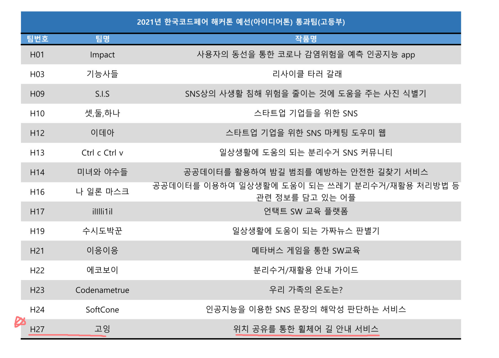
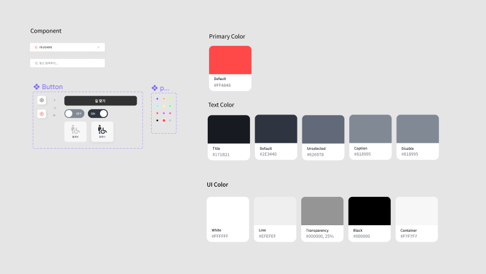
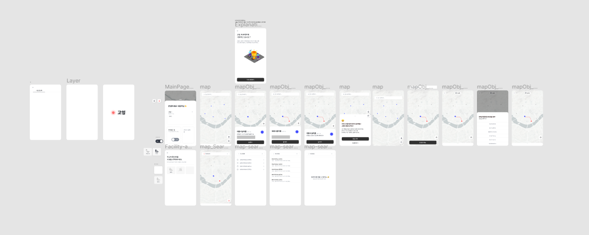
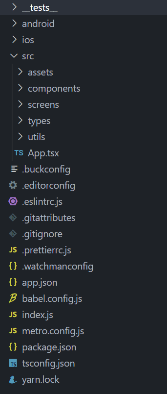

# 🙌 첫 해커톤

2021년 8월, 당시 처음 학교 자율 개발 동아리에서 후배 한 명과 함께 해커톤에 참여하게 되었었습니다.
처음이다 보니 겁을 먹어 해볼까 말까 고민을 많이 해보았는데요...👀 당시 아무것도 하지 않고 시간을 보내기보다는 뭐라도 해보자는 생각이 들어 첫 외부 대회인 한국코드페어에 나가게 되었습니다.
  

## 해커톤 기획

당시 코드 페어의 해커톤 주제 선택은 키워드를 조합하는 방식으로 이루어졌습니다.. 저희 팀은 주어진 키워드를 조합하였고, 그 결과 여러 가지의 주제들이 나왔습니다.

1. 공공데이터 + 시세 및 물가 -&gt; 창업자 안내 서비스
2. 가짜뉴스 + SNS -&gt; 가짜뉴스 SNS
3. 배리어 프리 + 일상생활 -&gt; 전동휠체어 관련 서비스
4. 스타트업 + SNS -&gt; 스타트업 정보 서비스

저희는 위와 같은 주제들을 투표를 통해 하나의 주제를 선택하게 되었습니다.

<blockquote>배리어 프리 + 일상생활 -&gt; 전동휠체어 관련 서비스</blockquote>

## 💣 위기

저희 팀은 주제를 선정 후 어떤 방식으로 배리어 프리와 일상생활이라는 조합을 통해 도움을 줄 수 있을까 고민하게 되었고, 저희는 두 가지 기능을 생각하게 되었습니다.

1. 첫째. 위치 데이터를 기반으로 사회적 약자분들이 가기 힘든 길을 나타내 주자
2. 둘째. 주변 사용할 만한 공공데이터를 지도상에 표시해주자

하지만 여기서 문제 한 가지 문제가 생겨났는데 바로 서비스 특성상 모바일 서비스에 더 적합하다는 점 이었습니다. 하지만 저와 같이 나간 후배, 매칭된 팀원 모두 모바일 환경에서 개발해본 적 없는 친구들이었고, 저희는 회의를 해본 결과 무모한 도전이지만 사용자들의 서비스 편의성을 위해 처음 해보는 모바일 서비스를 개발을 해보기로 결심하였습니다.  

## 다행인 점?

그나마 다행인 부분을 생각해보자면 저희 팀 프론트엔드 개발자들의 스택이 모두 React를 사용하였기 때문에 그나마 React와 비슷한 React Native를 사용하여 편리하게 개발할 수 있었습니다.

1. 프론트 : React-Native, Typescript
2. 백엔드 : NestJS, MongoDB
3. 협업 : Github, Slack

이후 저희는 위의 스택으로 결정하고 기획안을 제출하여, 예선에 합격하게 되었고, "고잉"이 시작 되었습니다.  

  

# 🎨 디자인 과정

저희 서비스의 개발 과정은 시간상의 문제로 디자인과 백엔드를 동시에 진행했고, 이후 다 같이 프론트를 진행하였습니다. 저는 그 중 디자인을 맡았었기 때문에 디자인에 대해서 말씀드릴게요.  

## 기획 구체화는 다음 기회에..

아무래도 해커톤 자체가 시간이 그렇게 넉넉한 편은 아니였습니다. 그래서 자연스레 "기획까지 우리가 맞추고 가는 게 맞을까?"라는 생각이 문득 들게 되었고, 결과적으로 어렵겠지만 저는 디자인과 기획 구체화를 같이 진행하게 되었어요. 아무래도 저 혼자 디자인하고 기획하다 보니 힘들긴 했지만, 결과적으로는 성공적이지 않았나 싶습니다…😞  

## 피그마의 자체 기능 😊

디자인에 대해서 자세하게 설명하고 넘어가자면, 저는 피그마의 자체 기능을 사용하여 더 컴포넌트 재사용성을 높이고자 하였어요.  

  

위와 같이 디자인과 색상들을 컴포넌트화시켜 보다 효율적으로 디자인을 진행했어요. 저희 브랜딩 컬러는 레드로 결정하게 되었는데, 레드라는 색상의 이미지 자체가 에너지, 열정, 행동을 의미하고 따듯함과 긍정적인 삶을 나타내기에 저희 고잉 서비스의 의도와 알맞다고 생각하게 되었고, 색상의 뜻과 같이 사용자들에게 긍정적인 에너지를 나누고자 해당 색상을 브랜딩 컬러로 결정하게 되었어요.  

이렇게 우여곡절 끝에 아래와 같이 디자인이 전부 나오게 되었고, 프론트 개발을 진행하게 되었어요.  

  

# 🚌 개발 과정

저희 서비스 프론트는 개발에 앞서 미리 기본 세팅을 진행했어요. 개발 생산성을 위해 prettierrc와 Eslint를 사용하였고, 타입스크립트를 도입하여 코드 품질 및 생산성을 높였어요.  

디자인 패턴 부분에서는 atomic 패턴을 비롯한 여러 가지 디자인 패턴들이 나왔지만, 현재 서비스 자체 규모가 크지 않다는 점에서 오히려 다음과 같은 복잡한 패턴들은 문제가 될 수 있다고 생각하게 되었고, 최종적으로 아래 사진과 같이 screens와 components로만 나누어 최종적으로 세팅을 마무리 짓게 되었습니다

  

## 개발은 이렇게 진행됬어요..

이후 메인 개발을 진행하게 되었습니다. 아무래도 지도 서비스이다 보니 가장 먼저 지도를 불러오는 부분부터 개발을 진행하게 되었는데요.   

이때 매우 많은 지도가 의견에 나왔는데 크게 카카오 지도와 구글맵 MAPBOX라는 지도들이 의견에 나왔습니다. 하지만 카카오 지도의 경우 커스텀이 불가능하다 보니 저희가 디자인했던 지도의 느낌을 낼 수 없었고, 제외하게 되었습니다.  

이는 구글맵 또한 마찬가지였는데 한국과의 지도 반출 문제 이슈가 해결되지 않아 구글 맵또한 스타일 커스텀이 불가능해 해당 API 또한 제외하게 되었고, 최종적으로 MAPBOX를 사용하게 되었습니다.  

## MAPBOX의 불 친절함 😞

하지만…. 순탄하게만 흘러가지는 않았습니다. 문제 하나가 또 발생하게 되는데 바로 MAPBOX의 개발문서가 문제였습니다. 어떤 문제가 있었는지 이야기해보자면 개발문서에는 정의가 되어있으나 D.TS에는 정의가 안 되어있거나, 문서에 상세 설명이 없고 단순히 메소드 변수의 존재들만 알려주는 등 라이브러리 호환, 개발에 있어서 불 친절한 부분이 매우 많았습니다. (진짜 죽을 뻔….) 다행히 구글링을 통해 해결할 수 있었으나, 정말 힘들었던 경험이었던 거 같습니다.   

## 🚩 그 다음엔..?

이후 기본적인 UI 작업을 마감하였고, 아까 디자인과 함께 개발한 백엔드 부분에서 세팅한 데이터들을 바탕으로 Axios 라이브러리를 통해 데이터를 조회하여 프론트 부분에서 가공된 데이터를 Mapbox API를 사용하여 지도 위에 마커를 띄워 기능을 완성하였습니다. 이후 Mapbox 이슈를 해결하고 나서부터는 굉장히 순조롭게 개발을 마칠 수 있었던 거 같습니다.  

## 완성된 프로젝트

# 후기

솔직히 첫 대회라 좀 겁 먹었는데 생각보다 무서워 할 필요 없겠구나 생각이 많이 들었어요. 이후에도 대회가 열린다면 참여 해보아야겠다는 생각을 하게 되었습니다. 그리고 객관적으로 개발 완성도 자체는 저희 팀이 더 우세했다고 생각했지만 아무래도 아이디어, 컨셉 및 이외 부분에서 차이가 났던거 같고, 첫 대회인 만큼 외부 대회에 대한 경험치가 부족했기에 그만큼 더 많은 성장을 할 수 있어 좋았습니다.
