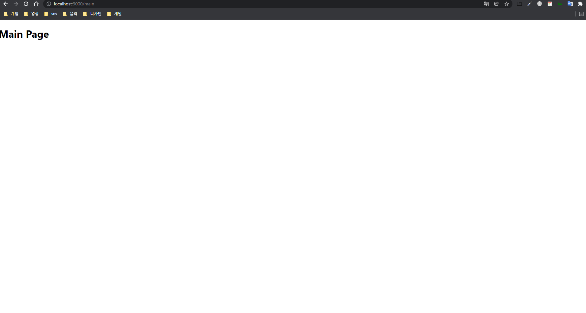
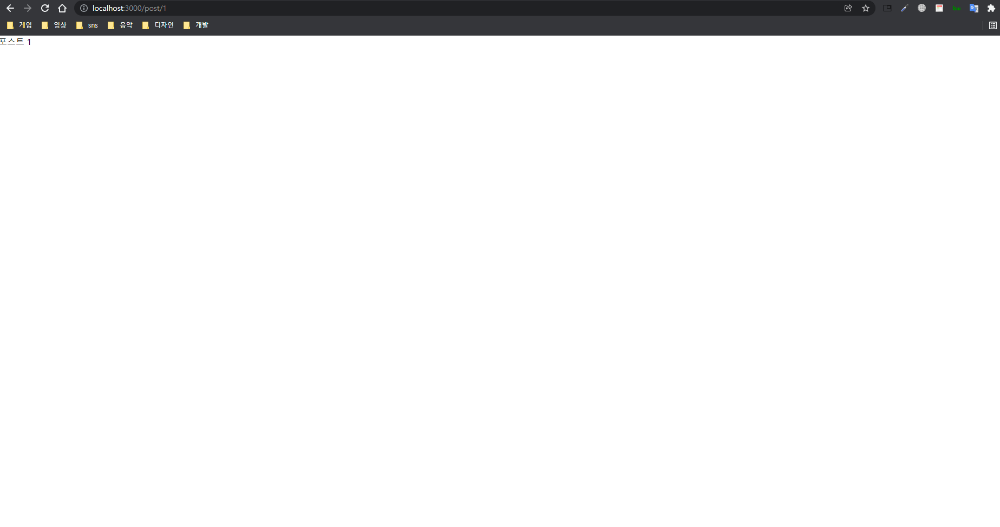

# SSR 도전기 !

Next js는 SSR 즉 서버사이드 렌더링 프레임 워크입니다. 사실 저도 기존의 React의 렌더링 방식인 CSR 클라이언트 서버 렌더링과의 차이점을 크게 몰랐는데
이번에 Next js를 접하게되면서 두 개의 렌더링 방식의 차이점을 크게 느낄 수 있었습니다. <br/><br/>

CSR 방식의 경우 모든 JS 파일을 로드하고 사용자는 이 파일들이 로드과 완료 될때까지 대기합니다. (생각보다 이 대기시간이 길더라구요...) 하지만 서버사이드 렌더링의 경우
서버에서 자바스크립트를 로딩함으로써 클라이언트 측에서는 자바스크립트를 로딩하는 시간이 줄어들게 됩니다.<br/><br/>

또 CSR의 결정적인 문제가 또 있는데 바로 SEO 문제입니다. CSR의 경우 자바스크립트가 로드 되지않은 경우 아무런 정보도 보이지 않습니다. 하지만 이 경우 구글 검색엔진 프로세스로 인해 자바스크립트가 로드되지 않은 페이지는 스캔되지 않습니다. 따라서 검색에 아무런 페이지도 걸리지 않게되죠.. 하지만 SSR의 경우 이 점을 서버 측에서 자바스크립트, HTML, CSS를 만들어 컨텐츠를 직접 업로드 해 검색 엔진에 걸리게 한다네요 !<br/><br/>

이제 Next를 직접 사용해볼까요?

Next는 create-react-app과 같이 간단하게 넥스트 애플리케이션의 환경을 구축해주는 CNA를 제공합니다.

```typescript
$ npx create-next-app
```

다음 명령어를 터미널에 입력해 프로젝트가 생성되면 package.json에서 설정된 세팅들을 확인해 볼 수 있습니다.

```json
{
  "name": "test",
  "private": true,
  "scripts": {
    "dev": "next dev",
    "build": "next build",
    "start": "next start",
    "lint": "next lint"
  },
  "dependencies": {
    "next": "12.0.7",
    "react": "17.0.2",
    "react-dom": "17.0.2"
  },
  "devDependencies": {
    "eslint": "8.6.0",
    "eslint-config-next": "12.0.7"
  }
}
```

참고로 타입스크립트를 추가하고 싶다면 뒤에 --typescript를 추가해주시면 됩니다.

```typescript
$ npx create-next-app [project name] --typescript
```

저는 타입스크립트를 좋아하기 때문에 타입스크립트를 추가하여 프로젝트를 만들겠습니다.

```
dev - 개발 모드에서 next를 시작
build - 프로덕션 사용을 위해 애플리케이션 빌드
start - next 프로덕션 서버 시작
lint - next의 내장 eslint 구성을 설정하는 린트를 실행
```

저는 yarn dev를 통해 개발 모드에서 next를 시작해주겠습니다.

<br/><br/>

그럼 위의 사진과 같이 Next js가 환영해주는 모습을 볼 수 있습니다.<br/><br/>
이제 한번 기본적인 기능을 한번 사용해볼까요? next와 react의 차이점이라고 하면 위에 언급했던 부분뿐만 아닌 다른 부분도 있는데
바로 라우팅 기능입니다. NextJS 경우 React와 달리 pages의 파일들이 자동으로 경로가 설정되게 됩니다.

```
/.next
/pages
  ㄴ-- index.tsx
  ㄴ-- main.tsx
/public
/styles
```

이렇게 pages 폴더안에 index와 main 라는 컴포넌트 두 가지가 있으면 바로 /main을 통해 별도의 라우팅 없이 이동할 수 있게 되는거죠.

<br/><br/>

그럼 이런 식으로 라우팅이 된걸 확인 할 수 있습니다.<br/> <br/>
다음은 정적 라우팅에 대해서 한번 알아보겠습니다. 정적 라우팅은 사전에 지정된 주소로 이동하는 방법을 말하는데
react-router-dom과 같이 Link 컴포넌트를 사용해 주소를 이동할 수 있습니다.

```typescript
import type { NextPage } from 'next';

import Link from 'next/link';
import styles from '../styles/Home.module.css';

const Home: NextPage = () => {
  return (
    <div className={styles.container}>
      <p>Hello Next.js</p>
      <Link href="/main">메인 페이지로 가기</Link>
    </div>
  );
};

export default Home;
```

다음은 동적 라우팅에 대해서 알아보겠습니다.

```
/.next
/pages
       /post
         ㄴ-- [test].tsx
  ㄴ-- index.tsx
  ㄴ-- main.tsx
/public
/styles
```

다음과 같이 post 폴더를 만들고 [test].tsx를 만든 것을 확인 할 수 있습니다.

```typescript
import Link from 'next/link';
import styles from '../styles/Home.module.css';

const Home: NextPage = () => {
  return (
    <div className={styles.container}>
      <p>Hello Next.js</p>
      <Link href="/main">메인 페이지로 가기</Link>
      <Link href="/post/1">동적 라우팅 페이지 가기</Link>
    </div>
  );
};

export default Home;
```

이후 post/1로 이동하면 자동으로 post/1로 라우팅 해 들어가지는 것을 확인 할 수 있습니다.

<br/><br/>

오늘은 다음과 같이 간단한 NextJS의 장점과 환경 구축, 라우팅에 대해서 체험(?) 해보았는데 생각보다 어려울줄 알았지만 기존의 리액트와 크게 다른 부분은 없었기 때문에 지금 해당 포스팅을 보는 여러분들도 겁내지 말고 한번쯤 배워보는 것도 도움이 될 것 같습니다. 특히 직접 해보는 것과 보기만 하는 것은 분명 차이가 있기 때문에 심심할때 보면서 따라해 보세요 !
