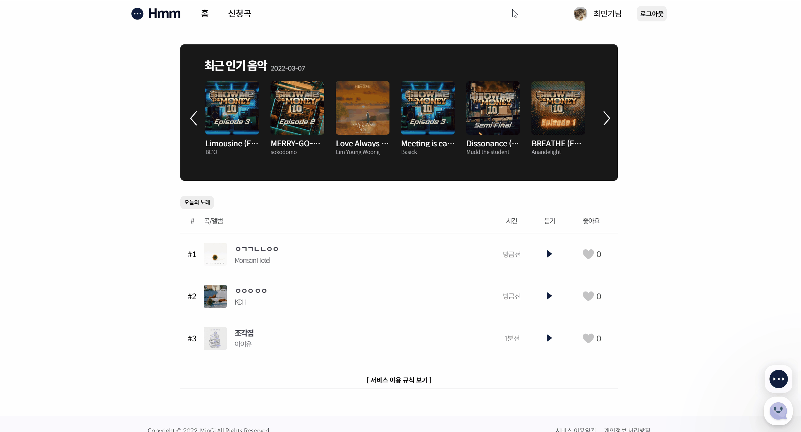
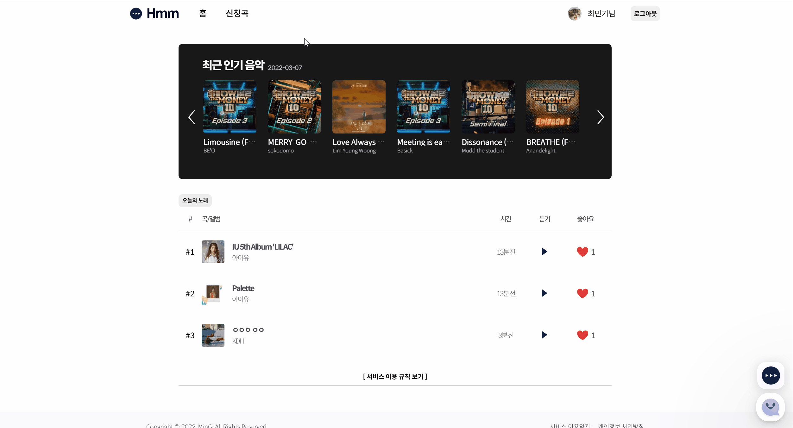
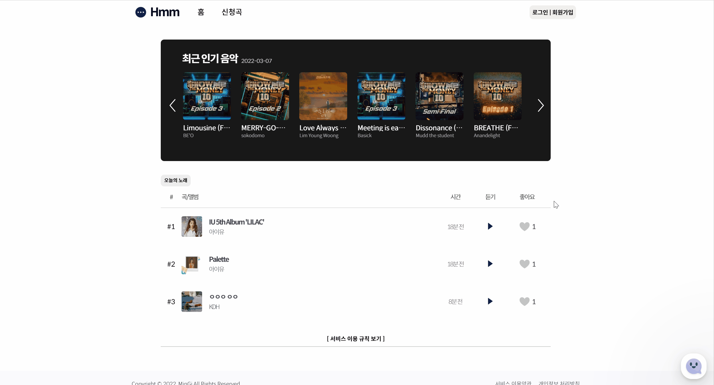

오늘은 약 2주간 준비한 프로젝트인 Hmm에 대해 소개하고 회고록을 작성해보려고합니다. 아직 부족한 부분이 많은 프로젝트이지만, 서비스하며 점차 개선해나가고 있으니 좋은 시선으로 봐주시면 감사하겠습니다 😄

## ✔️ 프로젝트 소개

대부분의 학교들은 점심시간에 노래를 틀어주는데요. 저희 학교또한 마찬가지로 점심시간에 노래를 틀어줍니다. 하지만, 내가 듣고싶은 노래가 아닌
방송부 측에서 틀고싶은 노래를 트는 방법으로 이루어져있었습니다.    

물론 방송부 측도 카카오 오픈채팅이나 페이스북 등 여러가지 방법을 사용해 신청곡을 받은 경우가 있지만,
방송부가 일일히 신청한 노래를 확인해야했고, 이상한 노래를 신청하는 친구들도 굉장히
많았기 때문에, 노래 신청 프로그램이 활성화는 되어있었으나 실제로는 거의 사용하는 경우가 없었습니다.
따라서 저는 위의 문제점을 개선하고, 사용성을 높혀 많은 친구들이 편하게 노래를 신청하는 서비스를 개발하고자 하였습니다.

## ✔️ 과정

해당 프로젝트를 완성시키기까지 가장 힘들었던 것은 개발이 아닌, 해당 서비스를 방송부 측에 이야기 하고 서로의 의견을 조절하여야 했고, 아이디어를 구상 및 디자인 하는 과정이 가장 힘들었던거 같습니다. 실제로도 서비스 준비까지 가장 오래 걸린 부분이 어느 부분이냐 묻는다면 저는 이 기간을 말할거 같습니다.    

다행스러웠던 점은 방송부 활동을 하는 친구가 있었기 때문에 그나마 커뮤니케이션에 있어 자유로웠지만, 그래도 해당 서비스를 개발하고 도입해야하는 이유를 설명하고 이해시켜야 해야했기 때문에 저는 친구에게 보여줄 수 있는 기획과 디자인 부터 완성을 하였습니다.

### 🎨 기획, 그리고 디자인

우선 기획을 따로 노션이나 서류화를 통해 하진 않았습니다. 혼자였기 프로젝트를 진행했기 때문에
굳이 문서화 시킬 필요성을 느끼지 못하였기 때문입니다.😭 (대부분 서비스 자체가 기획에서 터진 경우가 너무 많았습니다..)
   

따라서 기획과 디자인을 동시에 진행했다고 보시면 편할 것 같습니다.
디자인에 있어서는 그렇게 힘든 부분은 없었습니다. 저희 학교는 디자이너가 거의 없다고해도 무방합니다.
따라서 보통 서비스를 진행하면 제가 디자인 + 프론트엔드 개발을 모두 담당했기 때문에, 반쪽짜리 디자이너이지만 부족함 없이 디자인 할 수 있었습니다.

`✨ 사이트의 디자인은 아래에서 확인하실 수 있습니다.`

### 🔧 개발 스택에 관해

이후 디자인이 끝나고 어떤 개발 스택으로 서비스할지 고민하게 되었습니다.  
결론적으로 
`Next js` `FireBase` `Typescript` `Jest` `Storybook` `AWS EC2`

다음과 같은 기술들을 사용하기로 결정하였습니다. 해당 포스팅을 보시는 분들의 대부분 위의 기술들이 익숙하실텐데요.
왜 사용했는지 최종적으로 좋은 결정이였는지 이야기 해보도록 하겠습니다.   

🤚 `NEXT JS`  
최근들어 굉장히 핫한 프레임워크입니다. REACT를 기반으로 하고 있는 기술인데, 해당 기술의 핵심은 SSR 즉 서버 사이드 렌더링입니다. 이 밖에도
저는 자동 라우팅, 이미지 최적화등 굉장히 편리한 프레임워크라고 생각하였고, 해당 기술을 선택하게 되었습니다.  

하지만 아쉬웠던 점은 Firebase와 SSR을 같이 사용하기 굉장히 까다로웠기 때문에 유저 로직의 경우 CSR을 사용해 짤 수 밖에 없었던 점이 안타깝습니다. 이는 추후 리팩토링을 통해 해결할 예정입니다.   

🤚 `FIREBASE`  
FireBase는 백엔드 기능을 대체하기위해 사용한 플랫폼입니다. 물론 저희 학교에 백엔드를 하는 친구들이 있긴했지만,
대부분 아직 협업이 미숙한 친구들이 많았고, 개발또한 잘하는 친구들이 드물었기 때문에 FireBase로 아에 혼자 개발하고자
마음 먹고 개발하였습니다. 실제로 서비스 유저가 그렇게 많지 않기 때문에 나쁘지 않은 선택인거 같습니다. 추후에도 프로토타입이나,
많은 유저를 받아야하는 상황 아니라면 다시 쓸 의향이 있는 플랫폼 입니다.   

🤚 `TYPESCRIPT`  
타입스크립트는 그렇게 큰 이유가 있기보다는 타입스크립트의 기능 그대로 타입 명시를 위해 사용하였습니다.   

🤚 `JEST, STORYBOOK`  
Jest는 말 그대로 테스팅을 위해 선택했습니다. Jest 하나로 대부분의 테스트가 가능했기 때문에 사용했습니다. 스토리북은
매번 직접 사이트에서 매번 컴포넌트를 확인하는게 불편했기 때문에 스토리북을 사용해 이를 해결했습니다.   

🤚 `AWS EC2`  
보통 사이트는 동적 웹사이트와 정적 웹사이트로 나뉩니다. 해당 사이트들의 주요 차이점은 '어디서 렌더링이 되는가'인데
동적 사이트는 서버 시이드 렌더링, 정적 사이트는 클라이언트 사이드 렌더링을 통해 생성되는 사이트라고 합니다.
여기서 저희 서비스는 Next JS를 사용한 것 부터 알 수 있지만, 동적 사이트에 해당이 되었기 때문에 굉장히 다양한 배포 사이트들이 있음에도
AWS EC2를 사용하게 되었습니다. 물론 EC2를 사용한건 처음이라 공부할게 많았지만 나쁘지 않은 선택이였던거 같습니다.

### 개발 후기, 페이지 소개

#### 1. 메인 페이지

  

위 사진은 실제 서비스 중인 Hmm의 메인페이지입니다. 메인페이지에서는
`배너`, `신청곡 TOP 3`, `서비스 이용 규칙`으로 크게 세 가지 나뉘어져 있습니다.    

`배너`에서는 한국에서 최근 인기있었던 노래 100개를 보여줍니다. 이때
API는 스포티파이 API를 사용하여 최근 멜론 100개의 앨범을 가져와 사이트에
뿌려주는 방식으로 개발을 진행하였습니다. 이때 캐로셀의 경우에는 직접 구현하였는데 컨테이너의 overflow를 통해 직접 ref로 접근하여 개발을 진행하였습니다. 그리고 부드럽게 움직이는 부분은 css의 `scroll-behavior: smooth;`를 사용하여 처리하였습니다.    

`신청곡 TOP 3`의 경우 직접 firebase에서 좋아요를 가장 많이 받은 세 가지의 노래를 가져오게 직접 로직을 만들어 진행하였습니다. 메인 페이지에서도 좋아요를 클릭할 수 있으며, 클릭시 실시간으로 좋아요가 변하며, 많은 좋아요를 받으면 바로 위치가 변하는걸 볼 수 있습니다.  
플레이 버튼은 그냥 사이트에서 바로 노래를 듣게 하고싶었지만, 저작권을 포함한 여러 문제들이 생길거 같아 포기하고, 버튼을 클릭 시 youtube로 이동하여 검색해주는 방식으로 해결하였습니다. 시간은 moment라는 라이브러리를 사용하여 시간을 포맷팅 해주었습니다.    

`서비스 이용 규칙`은 별로 볼 것은 없지만 처음에는 none처리 되어있다가 아래 버튼을 클릭 시 규칙을 확인할 수 있도록 개발하였습니다. 아직은 심심한 부분이 없지않아 있지만 조금씩 꾸며나갈 예정입니다.        

#### 2. 노래 신청 모달

   
모달에서는 크게 `노래 신청`, `신청한 노래 제거` 두 가지 기능을 제공합니다.
검색 창에 아무것도 입력하지 않은 경우에는 내가 신청한 노래 리스트를 확인할 수 있습니다. 이후 노래 검색을 통해 내가 원하는 노래를 신청할 수 있습니다. 노래 신청은 예외가 존재합니다. 노래 신청 최대 횟수인 5회를 넘어갈 경우, 이미 신청된 노래를 다시 신청한 경우 예외가 발생하며, 이 경우에는 신청이 불가능 합니다.        

#### 3. 신청곡 페이지

   
신청곡 페이지에서는 그동안 유저들이 신청한 노래들을 확인 할 수 있습니다.
이때 테이블은 `React Table`을 사용하였으며, 검색창 또한 이를 활용하여 개발하였습니다.        

#### 4. 로그인 페이지

   
로그인 페이지는 아래 물살이 가장 돋보이는 포인트라고 할 수 있습니다. 그만큼 여러 예시를 보며 어떻게 개발할지 고민하였는데 wave의 이미지를 뽑아 5개마다 투명도를 다르게 주고, `keyframes animate`를 활용하여 background의 position을 다르게 주어 시간마다 움직이도록 개발하였습니다. 원래는 하나하나 찍어 만들 생각이였지만, 굳이 그럴 필요까지 있을까 생각하게 되었고 쉽게쉽게 개발을 마칠 수 있었습니다.    
그 중 문제가 되었던 부분은 손 꼽아본다면 facebook, google, github 등 마다 관련 보안 정책이 있어 하나하나 고려해서 설정했어야했는데 그 부분만 제외한다면 firebase의 oauth를 사용한 것은 괜찮은 선택이였던거 같습니다.

## ✔️ 마무리

서비스를 시작하긴 하였으나, 아직 완성도가 그리 높다고는 생각되지 않습니다. 따라서 조금식 유지보수 하며, 더 좋은 코드를 완성시키고 싶습니다.
특히 해당 서비스를 개발하면서 typescript에 대한 숙련도와 jest나 storybook에 대한 사용처 또한 아직 실무에서 쓰는 만큼의 퍼포먼스는 뽑지 못하여 아쉬웠습니다.
